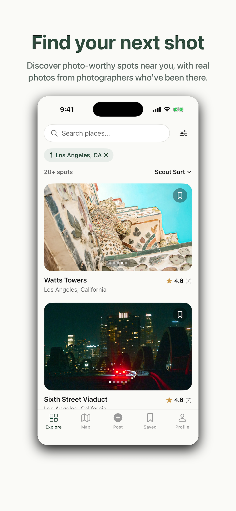
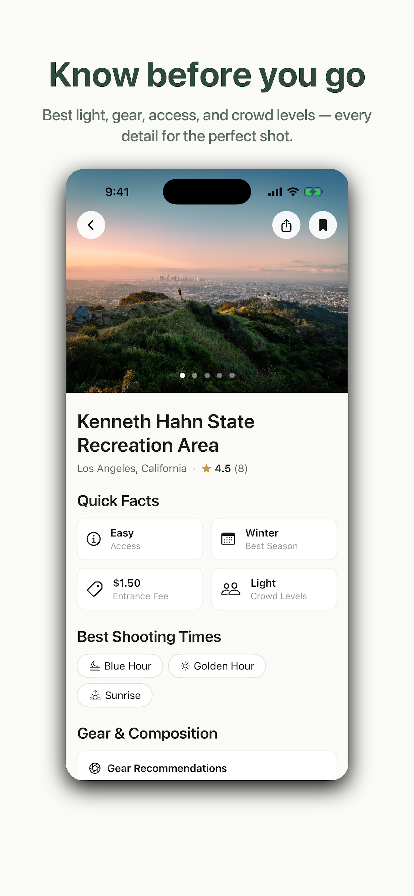
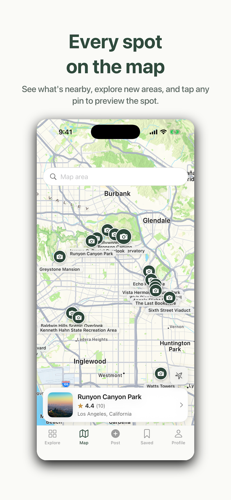
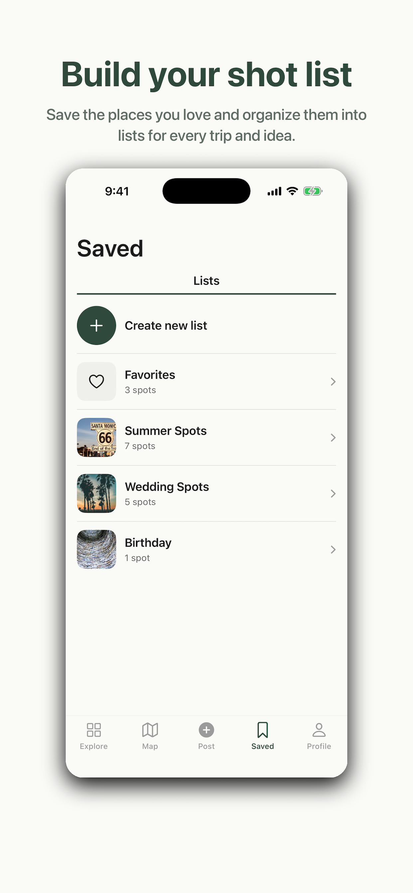
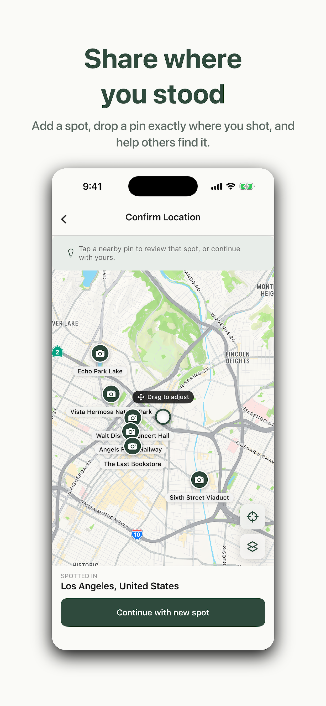
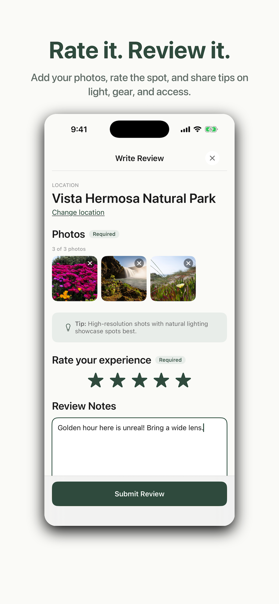
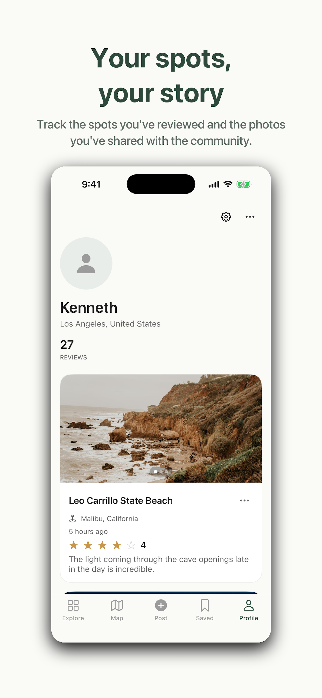

# Scout

**Find your next shot. Share where you stood.**

Scout is a photographer-focused spot-discovery app — find, view, review, and save great photo locations. Browse a searchable feed of spots with real photos from other photographers, see them on a map, and check the details that actually matter before you go: best light, gear, access, crowds, and seasons.

Built with SwiftUI for iPhone (iOS 26.1+).

---

## Screenshots

<p align="center">
  
  
  
</p>
<p align="center">
  
  
  
  
</p>

---

## Features

- **Explore** — a searchable, filterable, sortable feed of spots, each card a swipeable photo carousel. Paginated and geo-scoped to your location or a place you pick.
- **Map** — spots as pins (MapKit), with a "search this area" re-query, a recenter-to-user control, and tap-to-preview.
- **Spot Detail** — hero photos, quick facts, best shooting times, gear & composition tips, access logistics (permits / drone / tripod), and reviews. Share a spot's location to Maps.
- **Create & Review** — add a spot from a photo (EXIF location) or your current location, drop a pin on the map, then rate it and contribute photos, notes, gear, and tips.
- **Saved** — organize spots into lists (with a system "Favorites" list), save to multiple lists at once.
- **Profile** — your reviews, review count, and editable profile.
- **Auth** — Sign in with Apple, Google, or email (Firebase).

---

## Architecture

MVVM with SwiftUI `@Observable @MainActor` view models. The app gates on auth state (`RootView`) and renders a **custom tab bar** (`MainTabView`) rather than a stock `TabView`, so every tab keeps its own scroll position and navigation stack while switching.

```
Scout/
├── App/            ScoutApp (entry), RootView (auth gate), MainTabView (custom tab bar)
├── Screens/        Feature screens by area (Auth, Explore, Map, SpotDetail,
│                   Create, Saved, Search, Profile, Onboarding) — each with a
│                   local Components/ folder
├── Components/     Shared UI: Buttons, Cards, Forms, Lists, Map, Media,
│                   Navigation, States, Detail
├── DesignSystem/   s-prefixed design tokens — Color+S, Font+S, Spacing, CornerRadius
├── Models/         Domain types (Decodable, snake_case) — Spot, SpotDetail,
│                   Review, User, SavedList, PhotoMetadata, …
├── Services/       SpotService / UserService / SavedListService / LegalService,
│                   each with a Live (URLSession) and Mock implementation;
│                   AuthService, LocationManager, BackendClient
├── ViewModels/     @Observable view models + value types (filters, sorts, drafts)
├── Extensions/     Multipart, JPEG transcode, FlowLayout, region conversion
└── Assets.xcassets Colors, app icon

ScoutTests/         Swift Testing suites (view models, models, decoding, logic)
```

### Service layer

Each data domain is a protocol with two implementations:

- **Live** — talks to the REST backend over HTTPS with a Firebase ID-token `Authorization: Bearer` header. Shared HTTP plumbing lives in `BackendClient` (GET/POST/PATCH/DELETE + JSON decoding). JSON is snake_case + ISO-8601, decoded via `JSONDecoder.scout`.
- **Mock** — sample data for previews, tests, and offline development.

`AppServices` is the default dependency used across the app; view models accept an injectable service so they can be unit-tested against the mocks.

### Design system

All styling flows through `s`-prefixed tokens — colors (`Color.sAccent`, `Color.sBackground`, …), fonts (`Font.sHeadingM`, `Font.sBodyS`, …), and the `Spacing` / `Radius` enums. The brand palette is a forest-green accent (`#2F4A3D`) on a warm off-white (`#FAFAF7`), with a sage accent in dark mode. No raw hex or magic-number padding in screens.

---

## Tech stack

- **SwiftUI** for iPhone (iOS), deployment target **26.1**
- **Swift concurrency** — `async/await`, `@MainActor` default isolation
- **Firebase Auth** + **GoogleSignIn** (via Swift Package Manager)
- **MapKit**, **CoreLocation**, **PhotosUI / ImageIO** (EXIF read from picked photos)
- **Swift Testing** (`import Testing`, `@Test`, `#expect`)

---

## Getting started

### Requirements

- Xcode 26+ with the iOS 26.1 SDK
- An Apple developer team for signing
- A Firebase project (for auth)

### Setup

1. Clone the repo and open `Scout.xcodeproj` in Xcode.
2. **Add your `GoogleService-Info.plist`.** It is intentionally **not committed** (it's gitignored). Download yours from the Firebase console and drop it into the `Scout/` group. Make sure the `GIDClientID` and the `CFBundleURLSchemes` reversed-client-ID in `Info.plist` match your config.
3. Set your signing team and bundle identifier in **Signing & Capabilities**.
4. Point `BackendClient.baseURL` at your backend (defaults to a hosted HTTPS endpoint).

### Build & run

```bash
# Build for an installed iOS Simulator (e.g. iPhone 17)
xcodebuild -project Scout.xcodeproj -scheme Scout \
  -destination 'platform=iOS Simulator,name=iPhone 17' build

# Run the test suite (Swift Testing)
xcodebuild -project Scout.xcodeproj -scheme Scout \
  -destination 'platform=iOS Simulator,name=iPhone 17' test
```

> The `Scout/` group uses an Xcode 16+ synchronized file group — new `.swift` files dropped into it are picked up automatically.

---

## Testing

Tests use **Swift Testing** and live in `ScoutTests/`. View-model tests inject a stub service (e.g. `MockSpotService`) so business logic — pagination, filtering/sorting, submission payloads, EXIF parsing, region conversion, routing decisions — is verified without the network.

---

## Privacy

Scout collects email, name, precise location, photos, and review content — all tied to the signed-in account and used only for app functionality, never for tracking. The data declarations ship in `Scout/PrivacyInfo.xcprivacy`. The backend owns user records; the app only authenticates and forwards the Firebase ID token.
